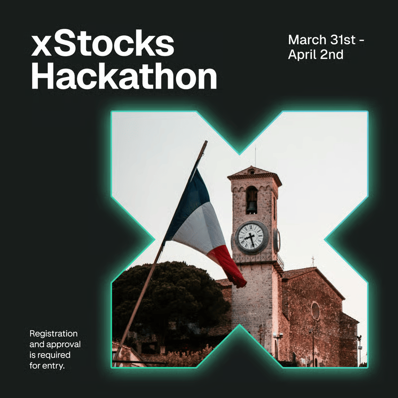

# xStocks Hackathon: Market Open — Knowledge Base 2026

This repository of knowledge guides you through getting started with the xStocks Hackathon, tokenized equities, and decentralized application development.

## TL;DR!

-   Find a team: [Find-A-Team](./find-a-team.md)
-   **Sign up** for the hackathon **on Devpost**: <https://xstocks-market-open.devpost.com/>
-   **Register on Luma**: <https://luma.com/xstocks-hackathon>
-   **Resources & Docs**: <https://xstocks.fi/hackathon/resources>

Rough hackathon schedule:
- _Tuesday, March 31_: **DOORS OPEN** - Kickoff & Welcome - **HACKING BEGINS**
- _Wednesday, April 1_: Full build day — workshops, mentorship, and collaboration
- _Thursday, April 2_: **SUBMISSIONS 10:00** - JUDGING - LUNCH - **AWARDS CEREMONY**
- _Thursday, April 2_: Make sure to show up for your judging slot! The judging timetable will start filling up when submissions close on Thursday morning.

   

## What is the xStocks Hackathon: Market Open?

The xStocks Hackathon: Market Open is an invite-only, in-person Hacker House taking place from **March 31st to April 2nd, 2026** in Cannes, France — within walking distance of the EthCC conference. It is a combination of a hackathon, workshops, and mentorship sessions, with a **$75,000 USD prize pool** up for grabs.

Hosted by **Kraken** in partnership with **xStocks**, this is an opportunity to build the next generation of onchain financial products using the xStocks tokenized equities framework.

### EthCC Conference

The EthCC conference runs concurrently in Cannes during the same period. Attendees of the hackathon are encouraged to also explore the broader EthCC schedule.

- See also: <https://ethcc.io/>

### Hackathon Venue

The hackathon takes place at a dedicated Hacker House in Cannes, France. Address will be shared with accepted applicants closer to the date.

## The Hack?!? What is a hackathon?

There are different types of hackathons, but the one at xStocks: Market Open has two purposes:

1.  Competing for prizes by building meaningful projects using the xStocks tokenized equities framework.
2.  Contributing to the broader DeFi ecosystem by pushing the frontier of onchain structured products, lending, and automated investment strategies.

## The Build Tracks

Projects must meaningfully integrate the xStocks framework and fall into one of three tracks:

### Borrow / Lend
Build the next generation of onchain structured products and leveraged exposure. Focus on capital efficiency and composability using tokenized equities as collateral or yield-bearing assets.

### Frontend
Create user-friendly DeFi interfaces designed for everyday users. Think about how to make tokenized equities accessible, intuitive, and beautiful.

### Strategy
Build automated investing tools using Ethereum Smart Accounts for programmable investment strategies powered by xStocks assets.

## Prizes

**Total prize pool: $75,000 USD**

| Place | Prize |
|---|---|
| 1st Place | $30,000 |
| 2nd Place | $20,000 |
| 3rd Place | $15,000 |
| Standout Idea Award | $10,000 (discretionary) |

See [Prizes and Tracks](./prizes.md) for full details.

## Judging Criteria

Projects are evaluated on a 0–100 scale across the following dimensions:

| Criterion | Weight |
|---|---|
| xStocks Integration & Depth | 30% |
| Technical Execution | 30% |
| Innovation & Originality | 15% |
| UX & Design | 10% |
| Market & Ecosystem Potential | 10% |
| Clarity of Presentation | 5% |

## Help?!? But I've never been to a Hackathon before!

That's fine, you are most welcome here — everyone brings valuable skills to a hackathon. But we're sure you have some questions.

## Do I have to be a developer?

No! We **welcome anyone who brings different skills** to a hackathon. Whether you want to help as a designer, project manager, give UX advice, write documentation, or something else — often the projects that do well are the ones that focus on more than just code.

## Key Rules

- All code and design work must **begin during the hackathon** period (March 31–April 2)
- No pre-existing projects — recycling prior work is not permitted
- Open-source libraries are permitted as long as they don't constitute the entire project
- Work must be performed exclusively by registered team members
- **AI tools** (ChatGPT, Claude, GitHub Copilot, Cursor, etc.) are permitted, but you must clearly document in your submission where and how AI tools were used
- **Physical attendance is required** — remote participation is not allowed
- Teams may have up to **6 members**

## Submission Requirements

Every project must submit:
1. A **functional demo** (working to the extent demonstrable)
2. A **public code repository** (e.g., GitHub)
3. A **video demo** (2 minutes maximum)
4. Adherence to the submission deadline on Thursday, April 2

## After the Hackathon

Winners and standout projects may receive:
- Access to the **xStocks ecosystem grant program**
- Priority consideration for **xStocks Alliance membership**
- Partner introductions and ongoing mentorship

---

Last, but not least: [Read our Community Code of Conduct](./code-of-conduct.md). Enjoy Cannes! ☀️
